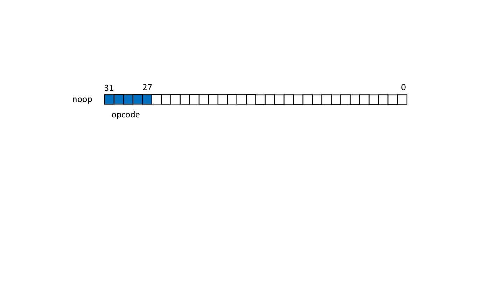

# TinyCPU

This repo contains verilog CPU implementations for a very small instruction set
called TinyISA.

* [first_cpu](/first_cpu) contains a multi-cycle TinyISA CPU
* [pipelined_basic](/pipelined_basic) contains a pipelined TinyISA CPU
* [cpu_forwarded](/cpu_forwarded) contains a pipelined TinyISA CPU with forwarding.

# Instructions

* no_op
* load_immediate \<IMM\> \<REG\>
* load_memory \<MEM LOC REG\> \<DEST REG\>
* store \<DATA REG\> \<MEM LOC REG\>
* jump \<CONDITION REG\> \<VALUE REG\>
* alu_op \<OPCODE\> \<OP 0 REG\> \<OP 1 REG\> \<DEST REG\>

# Instruction formats:

32 bits per instruction

[31:0]

[31:27] --> Instruction code

no op: op code 0
No data

load immediate: op code 1
[26:11] --> 16 bit immediate
[10:6] --> 5 bit register ID

load memory: op code 2
[26:22] --> mem location register ID
[21:17] --> dest register ID

store: op code 3
[26:22] --> data register ID
[21:17] --> mem location register ID

jump: op code 4
[26:22] --> condition register ID
[21:17] --> memory location register ID

ALU op: op code 5
[26:22] --> operand0 reg ID
[21:17] --> operand1 reg ID (ignored for unary operators)
[16:12] --> result reg ID
[11:7]  --> ALU operation

# ALU opcodes
| Operation | Opcode |
| --------- | ------ |
| or | 0 |
| and | 1 |
| xor | 2 |
| add | 3 |
| sub | 4 |
| mul | 5 |
| neq | 6 |
| logical not | 7 |

